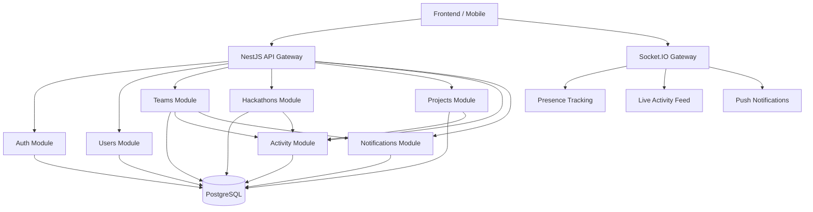
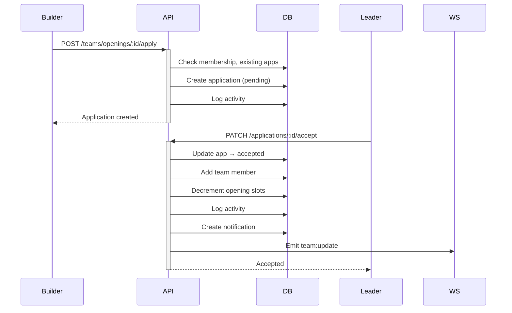

# ⚔️ Attack on Code — Backend Architecture

> **Architecture**: Modular Monolith
> **Runtime**: Node.js · NestJS
> **ORM**: Prisma · PostgreSQL
> **Auth**: JWT + Refresh Tokens
> **Realtime**: Socket.IO

---

## System Structure



---

## File Architecture

```
backend/
├── package.json
├── tsconfig.json
├── nest-cli.json
├── .env.example
├── prisma/
│   └── schema.prisma              ← 18 models, 16 enums
├── src/
│   ├── main.ts                    ← Bootstrap + Swagger
│   ├── app.module.ts              ← Root composition
│   ├── common/
│   │   ├── prisma/
│   │   │   ├── prisma.service.ts  ← DB connection lifecycle
│   │   │   └── prisma.module.ts   ← Global provider
│   │   └── decorators/
│   │       └── current-user.decorator.ts
│   ├── guards/
│   │   └── jwt-auth.guard.ts      ← Bearer token validation
│   ├── modules/
│   │   ├── auth/
│   │   │   ├── auth.module.ts
│   │   │   ├── auth.service.ts    ← Register, Login, Refresh
│   │   │   ├── auth.controller.ts
│   │   │   └── dto/auth.dto.ts
│   │   ├── users/
│   │   │   ├── users.module.ts
│   │   │   ├── users.service.ts   ← Builder Discovery engine
│   │   │   └── users.controller.ts
│   │   ├── teams/
│   │   │   ├── teams.module.ts
│   │   │   ├── teams.service.ts   ← Team Formation engine
│   │   │   └── teams.controller.ts
│   │   ├── hackathons/
│   │   │   ├── hackathons.module.ts
│   │   │   ├── hackathons.service.ts
│   │   │   └── hackathons.controller.ts
│   │   ├── projects/
│   │   │   ├── projects.module.ts
│   │   │   ├── projects.service.ts
│   │   │   └── projects.controller.ts
│   │   ├── activity/
│   │   │   ├── activity.module.ts
│   │   │   ├── activity.service.ts ← Event log + feed generation
│   │   │   └── activity.controller.ts
│   │   └── notifications/
│   │       ├── notifications.module.ts
│   │       ├── notifications.service.ts
│   │       └── notifications.controller.ts
│   └── websocket/
│       └── events.gateway.ts      ← Presence + live feeds
```

---

## API Surface

### Auth
| Method | Route | Auth | Description |
|--------|-------|------|-------------|
| POST | `/auth/register` | — | Create builder account |
| POST | `/auth/login` | — | Authenticate |
| POST | `/auth/refresh` | — | Refresh access token |

### Users (Builder Discovery)
| Method | Route | Auth | Description |
|--------|-------|------|-------------|
| GET | `/users` | — | Search builders (skills, availability, etc.) |
| GET | `/users/skills` | — | Get all skills for filter UI |
| GET | `/users/:id` | — | Get builder profile |
| PATCH | `/users/me` | ✅ | Update own profile |
| PATCH | `/users/me/skills` | ✅ | Update own skills |

### Teams
| Method | Route | Auth | Description |
|--------|-------|------|-------------|
| GET | `/teams` | — | Search teams (status, needed roles, hackathon) |
| GET | `/teams/:id` | — | Get team details |
| POST | `/teams` | ✅ | Create team |
| POST | `/teams/:id/openings` | ✅ | Create recruitment opening (leader) |
| POST | `/teams/openings/:id/apply` | ✅ | Apply to join |
| PATCH | `/teams/applications/:id/accept` | ✅ | Accept application (leader) |
| PATCH | `/teams/applications/:id/reject` | ✅ | Reject application (leader) |

### Hackathons
| Method | Route | Auth | Description |
|--------|-------|------|-------------|
| GET | `/hackathons` | — | List hackathons (upcoming/ongoing/past) |
| GET | `/hackathons/:id` | — | Get hackathon with teams + interested builders |
| POST | `/hackathons` | ✅ | Create hackathon listing |
| POST | `/hackathons/:id/interest` | ✅ | Express interest |
| POST | `/hackathons/:id/register` | ✅ | Register team (leader) |

### Projects
| Method | Route | Auth | Description |
|--------|-------|------|-------------|
| GET | `/projects` | — | List projects (needs contributors, status, search) |
| GET | `/projects/:id` | — | Get project workspace |
| POST | `/projects` | ✅ | Create project |
| PATCH | `/projects/:id` | ✅ | Update project (owner) |
| POST | `/projects/:id/needs` | ✅ | Add contributor need |

### Activity
| Method | Route | Auth | Description |
|--------|-------|------|-------------|
| GET | `/activity` | — | Global activity feed |
| GET | `/activity/user/:userId` | — | User activity history |
| GET | `/activity/:entityType/:entityId` | — | Entity activity feed |

### Notifications
| Method | Route | Auth | Description |
|--------|-------|------|-------------|
| GET | `/notifications` | ✅ | Get user notifications |
| PATCH | `/notifications/:id/read` | ✅ | Mark as read |
| PATCH | `/notifications/read-all` | ✅ | Mark all as read |

---

## WebSocket Events

### Client → Server
| Event | Payload | Purpose |
|-------|---------|---------|
| `user:online` | `{ userId }` | Register presence |
| `team:join` | `{ teamId }` | Subscribe to team updates |
| `team:leave` | `{ teamId }` | Unsubscribe from team |

### Server → Client
| Event | Payload | Purpose |
|-------|---------|---------|
| `activity:new` | Activity object | Live feed update |
| `notification:new` | Notification object | Push notification |
| `team:update` | `{ event, data }` | Team state change |
| `presence:update` | `{ onlineCount, onlineUserIds }` | Presence change |

---

## Key Business Logic

### Team Application Workflow


### Security
- **bcrypt** password hashing (12 rounds)
- **JWT** access tokens (15 min) + refresh tokens (7 days)
- **Rate limiting** (100 req/min global)
- **Input validation** (whitelist + forbidNonWhitelisted)
- **Authorization guards** (leader-only operations)

---

## Getting Started

```bash
cd backend
npm install
cp .env.example .env          # Edit with your credentials
npx prisma generate           # Generate Prisma client
npx prisma migrate dev        # Run migrations
npm run dev                   # Start with hot reload
```

Swagger docs available at `http://localhost:4000/docs`
