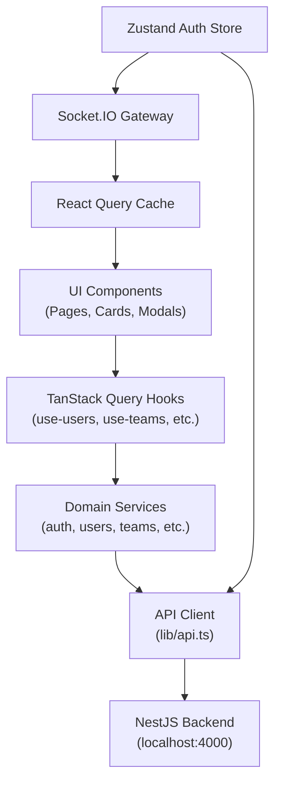
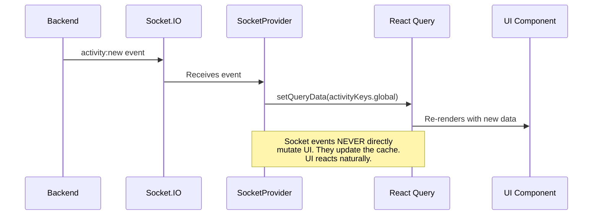
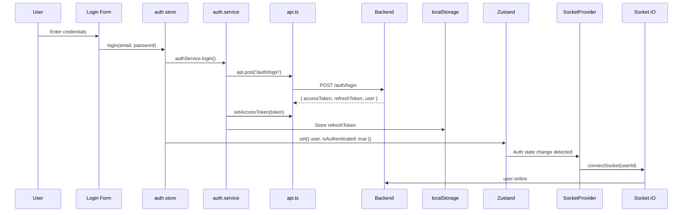

# ⚔️ Attack on Code — Frontend Integration Architecture

> **Framework**: Next.js 14 (App Router)
> **State**: TanStack Query (server) + Zustand (client)
> **Realtime**: Socket.IO Client → React Query Cache
> **Forms**: React Hook Form + Zod

---

## The 5-Layer Data Flow



> **Critical rule**: Components NEVER call `fetch()`. They use hooks. Hooks use services. Services use the API client. The API client handles auth headers, token refresh, and error normalization.

---

## File Architecture

```
frontend/src/
├── app/                           ← Next.js App Router
│   ├── layout.tsx                 ← Root layout + providers
│   ├── globals.css                ← Design system tokens
│   ├── providers.tsx              ← React Query + Socket + Auth init
│   ├── builders/page.tsx          ← Builder Discovery page
│   └── teams/page.tsx             ← Team Hub page
│
├── lib/
│   └── api.ts                     ← Core API client (THE foundation)
│
├── services/                      ← Domain API services
│   ├── auth.service.ts            ← Register, login, refresh, logout
│   ├── users.service.ts           ← Builder search, profile, skills
│   ├── teams.service.ts           ← Team CRUD, openings, applications
│   ├── hackathons.service.ts      ← Hackathon listing, interest, registration
│   ├── projects.service.ts        ← Project CRUD, contributor needs
│   └── activity.service.ts        ← Activity feeds + notifications
│
├── hooks/                         ← TanStack Query hooks
│   ├── use-users.ts               ← useBuilders, useBuilderProfile, useSkills
│   ├── use-teams.ts               ← useTeams, useCreateTeam, useApplyToTeam
│   └── use-data.ts                ← useHackathons, useProjects, useGlobalFeed, useNotifications
│
├── store/
│   └── auth.store.ts              ← Zustand: user session, login/logout/init
│
├── websocket/
│   ├── socket.ts                  ← Socket.IO client singleton
│   └── socket-provider.tsx        ← Provider: routes WS events → React Query cache
│
└── types/
    └── index.ts                   ← Complete TypeScript contracts (mirrors Prisma)
```

---

## API Client — The Foundation

[api.ts](file:///e:/AttackOnCode/frontend/src/lib/api.ts) is the single gateway to the backend:

| Feature | Implementation |
|---------|---------------|
| **Auth injection** | Auto-attaches `Bearer` token to every request |
| **Token refresh** | On 401, attempts refresh and retries the original request |
| **Deduplication** | Concurrent 401s share a single refresh attempt |
| **Query params** | Auto-serializes objects/arrays to URL search params |
| **Error normalization** | All errors become `ApiError(statusCode, message)` |
| **Typed methods** | `api.get<T>()`, `api.post<T>()`, `api.patch<T>()`, `api.delete<T>()` |

---

## React Query Caching Strategy

| Domain | Stale Time | Rationale |
|--------|-----------|-----------|
| **Builders** | 30s | Search results change moderately |
| **Skills catalog** | 5 min | Rarely changes |
| **Teams** | 15s | Formation status changes frequently |
| **Hackathons** | 60s | Event data is relatively stable |
| **Projects** | 30s | Moderate update frequency |
| **Activity feed** | 10s | Should feel live |
| **Notifications** | 5s | Must feel instant |

### Query Key Structure
Every domain uses structured keys for precise cache invalidation:
```typescript
teamKeys.all         // ['teams']           — invalidates everything
teamKeys.lists()     // ['teams', 'list']   — invalidates all list queries
teamKeys.list(params)// ['teams', 'list', {...}] — invalidates specific filter
teamKeys.detail(id)  // ['teams', 'detail', id] — invalidates one team
```

---

## WebSocket → Cache Bridge



This pattern ensures:
- **No duplicate state** — one source of truth (React Query cache)
- **Automatic consistency** — socket updates and REST responses use the same cache
- **Natural re-rendering** — components subscribed to queries re-render when cache updates

---

## Auth Flow



---

## Service → Backend Mapping

| Frontend Service | Backend Module | Key Operations |
|-----------------|---------------|----------------|
| [auth.service.ts](file:///e:/AttackOnCode/frontend/src/services/auth.service.ts) | AuthModule | register, login, refresh, logout |
| [users.service.ts](file:///e:/AttackOnCode/frontend/src/services/users.service.ts) | UsersModule | search, getProfile, updateProfile, updateSkills |
| [teams.service.ts](file:///e:/AttackOnCode/frontend/src/services/teams.service.ts) | TeamsModule | search, create, openings, apply, accept/reject |
| [hackathons.service.ts](file:///e:/AttackOnCode/frontend/src/services/hackathons.service.ts) | HackathonsModule | list, detail, expressInterest, registerTeam |
| [projects.service.ts](file:///e:/AttackOnCode/frontend/src/services/projects.service.ts) | ProjectsModule | list, create, update, addNeed |
| [activity.service.ts](file:///e:/AttackOnCode/frontend/src/services/activity.service.ts) | Activity + Notifications | feeds, notifications, markRead |

---

## Feature Page Data Flows

### `/builders` — Builder Discovery
```
Filter state → useBuilders(filters) → usersService.search() → GET /users?skills=react&available=true
```

### `/teams` — Team Hub
```
Status filter → useTeams({ status }) → teamsService.search() → GET /teams?status=recruiting
Click "Apply" → useApplyToTeam.mutate() → POST /teams/openings/:id/apply → invalidate teams cache
```

### `/hackathons` — Hackathon Tracker
```
Tab (upcoming) → useHackathons('upcoming') → GET /hackathons?filter=upcoming
"Show Interest" → useExpressInterest.mutate() → POST /hackathons/:id/interest
```

### Home — Activity Feed
```
useGlobalFeed() → GET /activity → initial data
Socket 'activity:new' → setQueryData → live update
```
